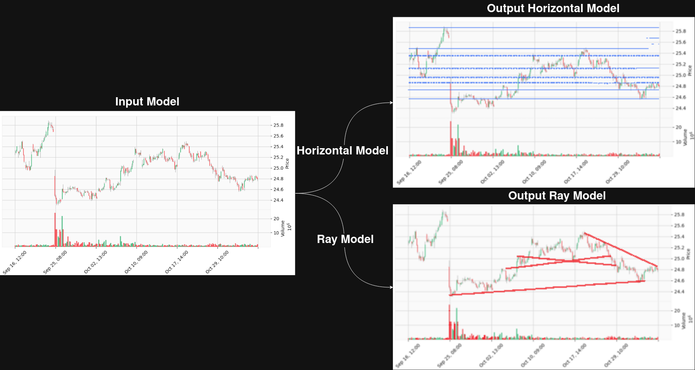
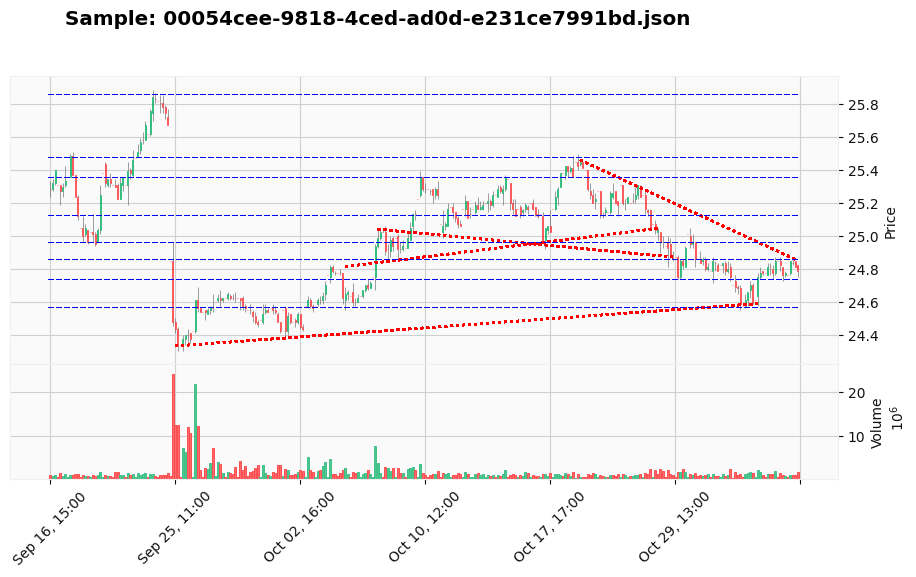

# OHLCV Technical Analysis - Chart Pattern Recognition

### Example of Input --> Models --> Outputs


### Expected Output


## Description of the Problem

### Background
Stock chart analysis is crucial for traders seeking support/resistance levels. Traditional methods rely on manual interpretation of OHLCV charts, which is time-consuming and prone to subjective bias. Automating chart pattern recognition enables faster, objective, and scalable technical analysis.

### Problem Statement
Financial analysts and traders need a system to:

- **Detect Horizontal Support/Resistance Levels** automatically from OHLCV charts.
- **Detect Ray Support/Resistance Levels** that extend across a trend line.
- **Provide Masked Outputs**: Generate masks over chart images highlighting predicted levels.
- **Scale Analysis**: Analyze hundreds of charts automatically without manual inspection.

### Solution Approach
This project implements a **dual-model pipeline** using deep learning:

1. **Data Preparation**: Raw OHLCV JSON data is converted into chart images and corresponding masks.
2. **Horizontal Support Model**: A U-Net-based model trained to predict horizontal support levels from chart images.
3. **Ray Support Model**: A separate U-Net-based model trained to predict ray-like support lines from chart images.
4. **Deployment**: Flask API and Kubernetes for scalable predictions.

The pipeline processes OHLCV data into images, applies the models, and outputs masks highlighting predicted support/resistance levels.

### Business Impact
- **Traders**: Automated detection of chart patterns for decision-making.
- **Hedge Funds**: Faster screening of multiple assets across portfolios.
- **FinTech Platforms**: Serve predictions via API to retail and institutional clients.
- **Research Teams**: Use masks for backtesting and model evaluation.

## Instructions on How to Run the Project

### Prerequisites

#### System Requirements
- Python 3.10 or higher
- Docker (for containerization)
- Kubernetes & Minikube (for orchestration)
- Jupyter Notebook
- 8GB RAM minimum
- 5GB free disk space

### Local Development Setup

#### 1. Environment Setup
```
# Create and activate virtual environment
python -m venv OHLCV_tech_venv
source OHLCV_tech_venv/bin/activate  # On Windows: OHLCV_tech_venv\Scripts\activate

# Install dependencies
pip install -r requirements.txt
```

#### 2. Data Setup
- Place raw OHLCV JSON files in `data/`. These JSON files are used to generate chart images.
- Run your preprocessing script or notebook to generate training/testing images and masks into `dataset/`.

#### 3. Run the Complete Pipeline

**Step 1: Data Analysis and Model Training**
```
# Open Jupyter notebook for visualization, EDA, and feature exploration
jupyter notebook notebook.ipynb
```

**Step 2: Train Models**
```
# Train both U-Net models for horizontal and ray support detection
python train.py
```

This generates:
- `models/horizontal_unet.pth` - Horizontal support model
- `models/unet_ray.pth` - Ray support model

**Step 3: Start the Prediction Service Locally**

**Build the Docker image**
```
docker build -t ohlcv-predictor -f deployment/flask/Dockerfile .
```

**Run the Docker container**
```
docker run -it --rm -p 9696:9696 ohlcv-predictor
```

The Flask API will be available at: `http://localhost:9696`

**Test the service**
- Navigate to `deployment/flask/` and run:
```
jupyter notebook predict_test.ipynb
```

**Step 4: Kubernetes Deployment**

Deploy to Minikube from the project root:
```
./deployment/kubernetes/deploy.sh
```

This deploys the service with:
- Health checks and auto-restart
- Resource limits (CPU: 250m-500m, Memory: 512Mi-1Gi)
- Service exposure on port 9696

[For detailed Kubernetes setup, see `./deployment/kubernetes/README.md`]

## API Usage

### Health Check
```
curl -X GET http://localhost:9696/health
```

### Support Line Prediction

**Input:** Chart image in base64 format (PNG/JPG).  
**Output:** Mask image highlighting predicted support lines.

**Example Request**
'''
curl -X POST http://localhost:9696/predict \
  -H "Content-Type: application/json" \
  -d '{
    "image_base64": "<BASE64_ENCODED_IMAGE>"
  }'
'''

**Example Response**
'''
{
  "horizontal_mask": "<BASE64_ENCODED_MASK>",
  "ray_mask": "<BASE64_ENCODED_MASK>"
}
'''

- `horizontal_mask`: Mask for horizontal supports  
- `ray_mask`: Mask for ray supports 

### Project Structure
```
OHLCV-technical-analysis/
├── data/                        # Raw OHLCV JSON files used to generate chart images
│   └── README.md
├── dataset/                     # Generated chart images and target masks for training/testing
│   ├── test/
│   │   └── input/               # Test input images
│   ├── train/
│   │   ├── full                 # Full training charts (optional)
│   │   ├── input                # Training input images
│   │   ├── mask_horizontal      # Target masks for horizontal support model
│   │   ├── mask_ray             # Target masks for ray support model
│   │   ├── target_horizontal    # Optional post-processed target for horizontal
│   │   └── target_ray           # Optional post-processed target for ray
│   └── README.md
├── deployment/                  # Deployment scripts and configs
│   ├── flask/                   # Flask API service
│   │   ├── Dockerfile
│   │   ├── Pipfile
│   │   ├── Pipfile.lock
│   │   ├── predict_test.ipynb   # Notebook to test API predictions
│   │   ├── predict.py           # Flask web service
│   │   └── README.md
│   └── kubernetes/              # Kubernetes manifests and deployment scripts
│       ├── deploy.sh
│       ├── deployment.yaml
│       └── README.md
├── imgs/                        # Visualization assets, plots, screenshots
│   └── README.md
├── models/                      # Saved trained models
│   ├── horizontal_unet.pth
│   ├── unet_ray.pth
│   └── README.md
├── notebook.ipynb               # Jupyter notebook for training & analysis
├── train.py                     # Model training script
├── requirements.txt             # Python dependencies
└── README.md                    # This file
``` 